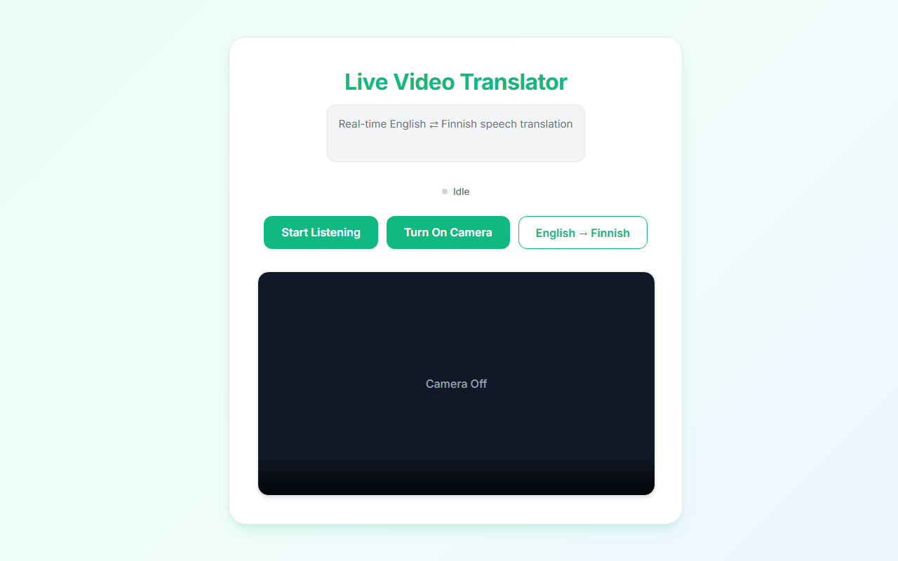

# Anti-Gravity Translation App  

An intuitive web application that translates live voice input between **English** and **Finnish** with near-zero latency.

---

## 🛠 Project Overview

### 1️⃣ Code Generation

The core logic was built using **Anti-Gravity**.

Instead of auto-deploying the app, the source code was generated locally using the following prompt:

> **Prompt:**  
> Give me a code for making a language translator which listens and translates the language to Finnish language. If the language is Finnish, it converts into English. I want output in text, but input should be live voice. There should be no latency. I should have a toggle button to have choice from English to Finnish or Finnish to English.
>
> This will return us the code for the application

---

### 2️⃣ Local Environment Setup

Since this application uses the **Web Speech API**, it must run in a secure context (local server) to access the microphone.

#### Step 1: Navigate to the project directory
Using Terminal

cd "translation app"

Step 2: Launch the local server

npx serve

Step 3: Open in Browser

Open:

http://localhost:3000

Important:
Use Google Chrome or Microsoft Edge for full Web Speech API support.

📸 Screenshots




📤 How to Move to GitHub
Step 1: Create a Repository on GitHub
Log in to your GitHub account.

Click the + icon in the top right and select New repository.

Name it anti-gravity-translator.

Set visibility to Public.

Important: Do not check the boxes for "Add a README" or ".gitignore" (as these already exist in your local folder).

Click Create repository and copy the HTTPS URL.

Step 2: Initialize Git Locally
Open your terminal in the project folder and execute these commands:

Bash
1. Initialize the folder as a Git repository

git init

2. Add all your files to the staging area

git add .

3. Save your changes with a message
git commit -m "Initial commit: Anti-gravity translator ready for deployment"

Step 3: Link and Push to GitHub

Connect your local folder to your GitHub repository. (Replace the URL with your actual URL from Step 1):

4. Point your local code to your GitHub URL

git remote add origin https://github.com/YOUR_USERNAME/anti-gravity-translator.git

5. Rename your default branch to 'main'

git branch -M main

6. Upload your code

git push -u origin main

Step 4: Verify the Results

Refresh your GitHub repository page. You should now see your index.html, app.js, style.css, and this README.md file displayed perfectly on the front page.

------------------------------------------------------------------------------------------------------------------------------------------------------------
# Home Work Task:

Tweak your application Using GEMINI CLI.

Upload the link of tweaked Git repo in a doc file

Below are detailed instructions on how to Use GEMINI CLI.


# Gemini CLI


Gemini CLI is an open-source AI agent that brings the power of Gemini directly
into your terminal. It provides lightweight access to Gemini, giving you the
most direct path from your prompt to our model.

Learn all about Gemini CLI in our [documentation](https://geminicli.com/docs/).

## 🚀 Why Gemini CLI?

- **🎯 Free tier**: 60 requests/min and 1,000 requests/day with personal Google
  account.
- **🧠 Powerful Gemini 3 models**: Access to improved reasoning and 1M token
  context window.
- **🔧 Built-in tools**: Google Search grounding, file operations, shell
  commands, web fetching.
- **🔌 Extensible**: MCP (Model Context Protocol) support for custom
  integrations.
- **💻 Terminal-first**: Designed for developers who live in the command line.
- **🛡️ Open source**: Apache 2.0 licensed.

## 📦 Installation

See
[Gemini CLI installation, execution, and releases](./docs/get-started/installation.md)
for recommended system specifications and a detailed installation guide.

### Quick Install

#### Run instantly with npx

```bash
# Using npx (no installation required)
npx @google/gemini-cli
```

#### Install globally with npm

```bash
npm install -g @google/gemini-cli
```

#### Install globally with Homebrew (macOS/Linux)

```bash
brew install gemini-cli
```

#### Install globally with MacPorts (macOS)

```bash
sudo port install gemini-cli
```

#### Install with Anaconda (for restricted environments)

```bash
# Create and activate a new environment
conda create -y -n gemini_env -c conda-forge nodejs
conda activate gemini_env

# Install Gemini CLI globally via npm (inside the environment)
npm install -g @google/gemini-cli
```


## 🔐 Authentication Options

Choose the authentication method that best fits your needs:

### Option 1: Login with Google (OAuth login using your Google Account)

**✨ Best for:** Individual developers as well as anyone who has a Gemini Code
Assist License. (see
[quota limits and terms of service](https://cloud.google.com/gemini/docs/quotas)
for details)

**Benefits:**

- **Free tier**: 60 requests/min and 1,000 requests/day
- **Gemini 3 models** with 1M token context window
- **No API key management** - just sign in with your Google account
- **Automatic updates** to latest models

#### Start Gemini CLI, then choose _Login with Google_ and follow the browser authentication flow when prompted

```bash
gemini
```

#### If you are using a paid Code Assist License from your organization, remember to set the Google Cloud Project

```bash
# Set your Google Cloud Project
export GOOGLE_CLOUD_PROJECT="YOUR_PROJECT_ID"
gemini
```


## 🚀 Getting Started

### Basic Usage

#### Start in current directory

```bash
gemini
```

#### Include multiple directories

```bash
gemini --include-directories ../lib,../docs
```

#### Use specific model

```bash
gemini -m gemini-2.5-flash
```

#### Non-interactive mode for scripts

Get a simple text response:

```bash
gemini -p "Explain the architecture of this codebase"
```

For more advanced scripting, including how to parse JSON and handle errors, use
the `--output-format json` flag to get structured output:

```bash
gemini -p "Explain the architecture of this codebase" --output-format json
```

For real-time event streaming (useful for monitoring long-running operations),
use `--output-format stream-json` to get newline-delimited JSON events:

```bash
gemini -p "Run tests and deploy" --output-format stream-json
```

### Quick Examples

#### Start a new project

```bash
cd new-project/
gemini
> Write me a Discord bot that answers questions using a FAQ.md file I will provide
```

#### Analyze existing code

```bash
git clone https://github.com/google-gemini/gemini-cli
cd gemini-cli
gemini
> Give me a summary of all of the changes that went in yesterday
```

---

## ✅ Homework Tweak Log

The `live-translator/` (React) app was tweaked for a more polished, production-feel UI:

- Added an app header with a subtitle describing the tool
- Added a live "Listening..." status indicator with a pulsing dot
- Added a soft gradient page background and stronger card shadow for visual depth
- Added a subtle fade-in animation on new translated subtitles

Run it with:

```bash
cd live-translator
npm install
npm run dev
```

